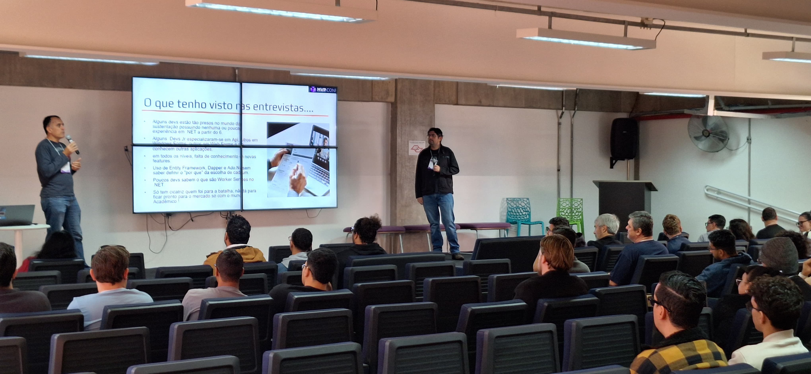
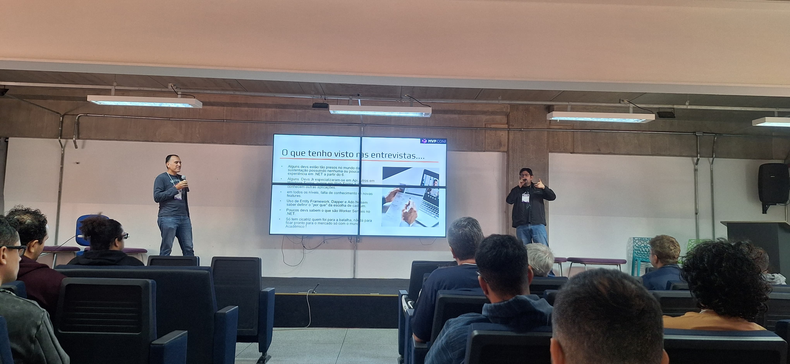
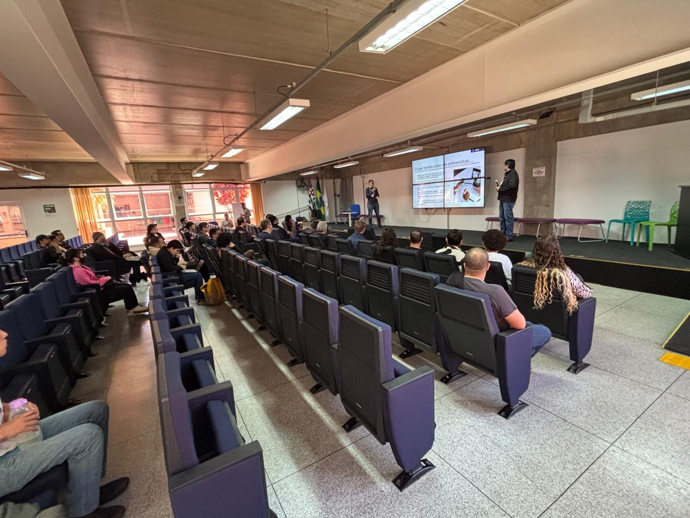
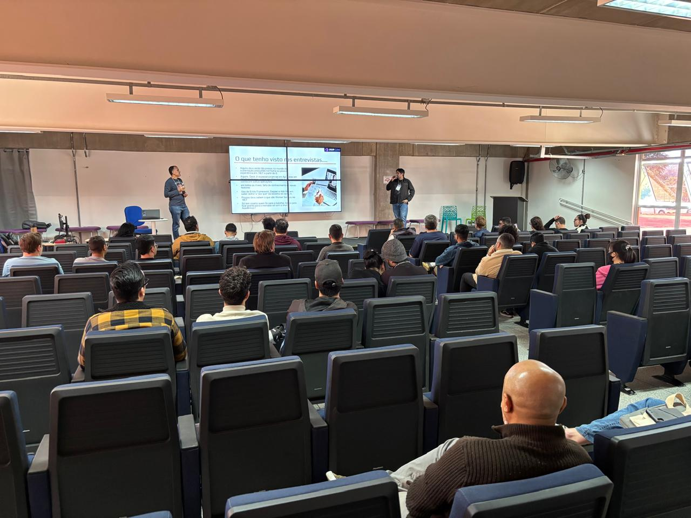
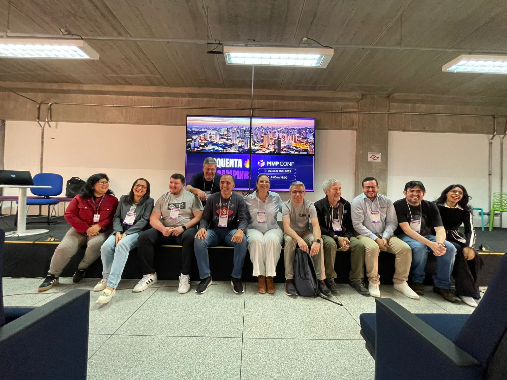
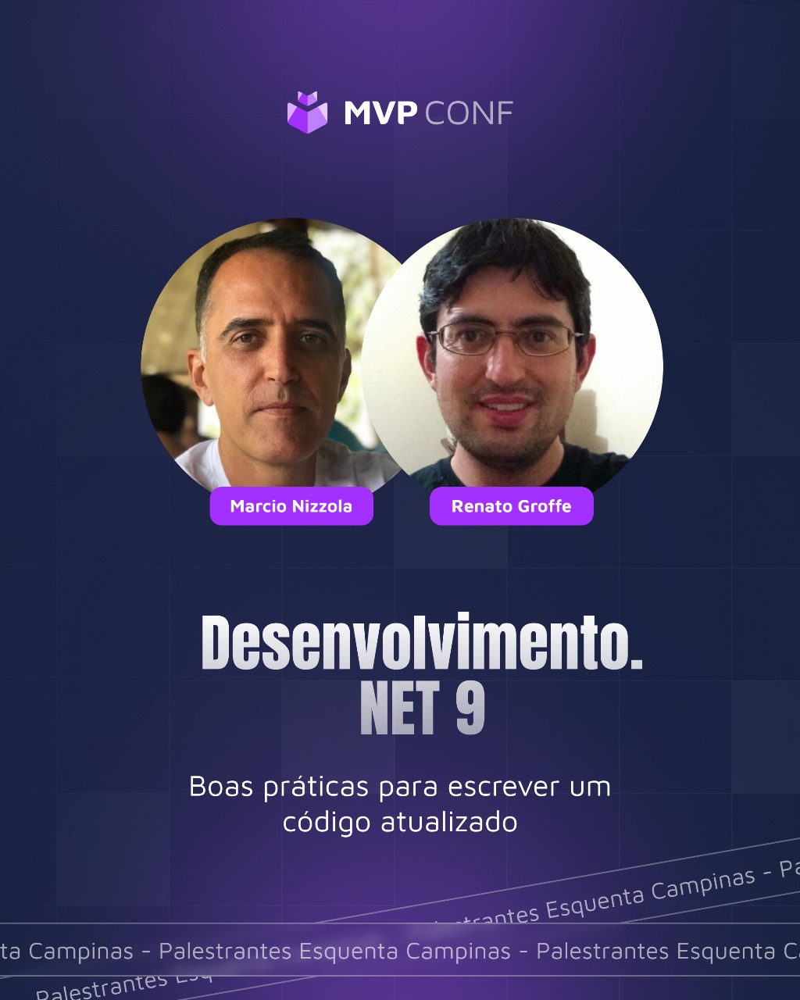

# dotnet9-boas-praticas_esquenta-mvpconf-campinas-2025
Conteúdos de apresentação sobre boas práticas com .NET 9 de apresentação realizada no dia 31/05/2025, durante o Esquenta MVPConf Campinas em Campinas-SP.

---

## Informações sobre o evento

Título da apresentação: **Desenvolvimento em .NET 9 - Boas práticas para escrever um código atualizado**

Data: **31/05/2025 (sábado)**

Tecnologias e tópicos abordados: **.NET, ASP.NET Core, C#, Azure DevOps, GitHub Actions, Visual Studio 2022, Visual Studio Code, Containers, Twelve Factor App, Microservices, DevSecOps, Docker, Docker Compose, Kubernetes, JWT, OWASP, APIsec Scanner...**

Número de participantes: **40 pessoas**

O Esquenta MVPConf é um evento presencial promovido pela comunidade de MVPs Microsoft no Brasil, acontecendo ao longo de 2025 em Campinas-SP e outras cidades brasileiras.

Site do evento: **https://hubconnecteventos.com.br/evento/esquentamvpconfcampinas**

Local: **Fatec Campinas - Avenida Cônego Antônio Rocato, 593 - Chácaras Campos dos Amarais - Campinas-SP - CEP: 13082-015**

Esta palestra foi realizada em conjunto com meu amigo **Márcio Nizzola (Microsoft MVP)**.

Deixamos aqui nossos agradecimentos à **Vanessa Valle**, ao **Rafael Paiva** e demais MVPs envolvidos com o evento por todo o apoio para que partipássemos como palestrantes.

---

